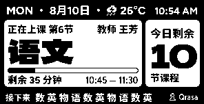

<p align="center">
  
</p>
<h1 align="center">ClassPad</h1>

ClassPad 是一个用于 MindReset Quote/0「摘录」设备的电子课表显示服务端。

它会读取 CSES（通用课表交换格式）课表，根据当前时间生成正在上的课程、下一节课程、课间状态、课程进度和今日剩余课程，并通过 Dot Canvas API 推送到一个或多个 Quote/0 设备。

## 功能

- 支持 CSES 通用课表交换格式
- 自动显示当前课程、下一节课程和课间休息
- 显示课程教师、上课时间、剩余时间和实时进度
- 支持多个账号、多个设备和不同设备的显示所有者
- 支持按设备配置城市并自动获取实时天气
- 只在显示内容变化时推送，减少不必要的网络请求
- 配置文件和设备文件统一放在 `config/` 目录
- 内置 CSES 解析器，无需额外安装课表解析工具

## 项目结构

```text
ClassPad/
├── config/
│   ├── config.yaml       # 服务运行配置
│   └── devices.yaml      # 账号、Token 和设备配置
├── schedule/             # CSES 课表文件
├── lib/pycses/           # 内置 CSES 解析器
├── src/
│   ├── app.py            # 单轮运行和推送去重
│   ├── canvas_client.py  # Dot Canvas API 客户端
│   ├── cses_schedule.py  # CSES 课表读取
│   ├── schedule_service.py # 课程状态和显示数据生成
│   └── weather.py        # Open-Meteo 天气服务
├── tests/                # 自动化测试
├── main.py               # 服务入口
└── requirements.txt      # Python 依赖
```

## 安装

建议使用 Python 3.10 或更高版本：

```powershell
python -m pip install -r requirements.txt
```

## 配置设备

编辑 `config/devices.yaml`：

```yaml
tokens:
  - name: account-a
    token: dot_app_xxx
    owner: Qrasa
    devices:
      - sn: 7CE8B17A3D10
        location: Songjiang
      - sn: ABCD1234EF56
  - name: account-b
    token: dot_app_yyy
    owner: TeamB
    devices:
      - sn: 112233445566
        owner: Alice
```

说明：

- 一个 Token 可以配置多个设备。
- `owner` 可以在账号级别设置，也可以在单个设备上覆盖。
- `location` 使用英文城市名，用于自动获取实时天气；不配置时由 Canvas 模板显示默认示例天气。

## 配置服务

编辑 `config/config.yaml`：

```yaml
push_interval_seconds: 30
request_timeout_seconds: 15
devices_file: devices.yaml
cses_file: schedule\example.yaml
```

- `push_interval_seconds`：服务循环间隔，单位为秒。
- `request_timeout_seconds`：每次网络请求的超时时间，单位为秒。
- `devices_file`：设备配置文件路径，相对 `config/config.yaml` 所在目录解析。
- `cses_file`：CSES 课表文件路径，相对项目根目录解析。

## CSES 课表

将课表文件放入 `schedule/`，然后在 `config/config.yaml` 中指定：

```yaml
cses_file: schedule\example.yaml
```
（当然你也可以直接从 [ClassIsland](https://github.com/classisland/classisland) 等软件中导出CSES）

服务端会自动读取 CSES 文件，并在文件修改后重新加载。课表中的科目、教师、星期、开始时间和结束时间会用于生成 Quote/0 的显示内容。

## 运行

```powershell
python .\main.py
```

服务会持续运行，默认每 30 秒检查一次。只有设备显示数据发生变化时才会向设备推送。

## 测试

```powershell
python -m unittest discover -s tests -v
```

## 许可证

本项目使用 GNU General Public License v3.0，详见根目录的 [LICENSE](LICENSE)。

`licenses/` 目录包含内置 CSES 解析器及 Python 第三方依赖的许可证文本。
